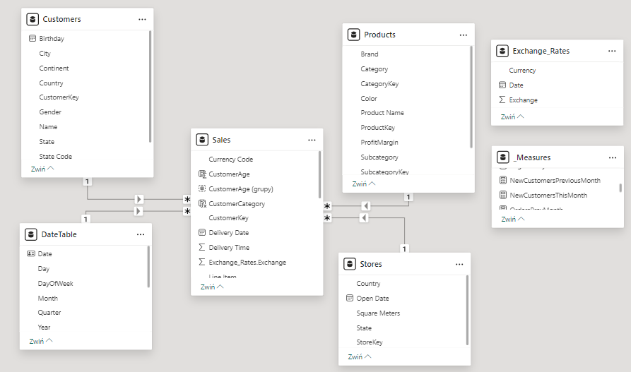

[Click **HERE** to view the dashboard on my **NovyPro** account](https://project.novypro.com/9OXJcX)

A dashboard I made in PowerBI, based on the dataset [Global Electronics Retailer from Maven Analytics](https://mavenanalytics.io/data-playground?order=date_added%2Cdesc&search=global%20elec). 

## Project Notes

Starting with the schema, I used the existing [Sales] table as the facts table, with the remaining tables being dimension tables, and created a date table in PowerQuery in M:
```
DateTable = List.Dates(#date(2016,01,01),365*5+54,#duration(1,0,0,0))
```


As per usual, I tried to do as many of the preliminary transformations as I could in PowerQuery. For example, I added a column to calculate the Delivery Time for Online sales, joined the [Exchange_Rates] to [Sales] to accomodate different currencies, etc.

I got to practice some DAX with Time Intelligence functions, for example to calculate the number of Recent Customers in the previous month:
```
RecentCustomersLastMonth = CALCULATE(DISTINCTCOUNT(Sales[CustomerKey]),Sales[CustomerCategory] = "Recent", DATESMTD(DATEADD(DateTable[Date],-1,MONTH)))
```
Speaking of recent customers, in order to explore customer churn, I arbitrarily divided the Customer Key field in [Sales] into 3 groups:

- **New**: a customer making their first order ever,
- **Recent**: a customer who's made a previous order within the preceeding 90 days,
- **Recovered**: a customer who's previous order was over 90 days ago.

I considered a few ways of achieving this, eventually reluctantly settling on a calculated DAX column in the [Sales] table:
```
CustomerCategory = VAR X = DATEDIFF(
                              CALCULATE(MAX(Sales[Order Date]),
                                         FILTER(All(Sales), Sales[Order Date] < EARLIER(Sales[Order Date]) && Sales[CustomerKey] = EARLIER(Sales[CustomerKey]))),
                              [Order Date], DAY)

RETURN SWITCH(TRUE, X = 0, "New", X < 91, "Recent", x >= 91, "Recovered")
```
As for the visual side of things, the dashboard can be navigated via the sidebar on the left side of the screen. Recently I've seen more and more of those, so I decided to follow the trends. I used bookmarks to create a filters window that can be opened by clicking the button on the upper left corner. I also aimed to limit the number of visuals on every page and maintain a consistent color scheme to improve readability.
