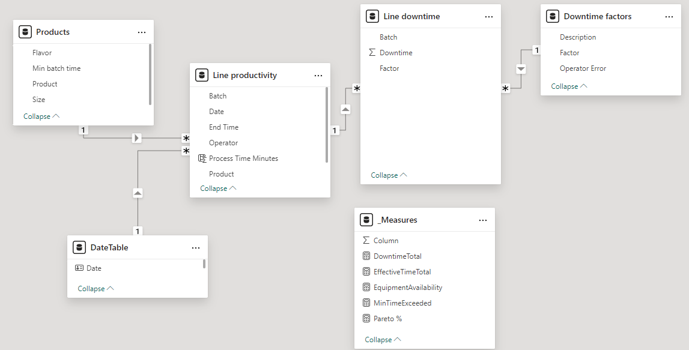

[Click **HERE** to view the dashboard on my **NovyPro** account](https://project.novypro.com/b8g054)

A comprehensive, single-page dashboard I made in PowerBI, based on the dataset [Manufacturing Downtime from Maven Analytics](https://mavenanalytics.io/data-playground).

The goal is set for myself with this project was to create a concise report that allows the stakeholders to quickly check the overall production performance and key factors contributing to downtime.

## Project Notes
### Schema
The schema is shown below:

The Measures table contains all the DAX measures. The DateTable was created in PowerQuery using M:
```
DateTable = List.Dates(#date(2024,08,29),6,#duration(1,0,0,0))
```
### Pareto chart
In manufacturing engineering, in order to identify the crucial factors we often use the Pareto chart, an approach initially popularized by Joseph M. Juran in the 1940s. The Pareto principle states that roughly 80% of consequences come from 20% of causes. Unfortunately, PowerBI doesn't come with a easily available Pareto chart (unlike, say, Excel), so I resorted to DAX. In order to create the Pareto chart, I used the following DAX code:
```
Pareto % = 
VAR TotalHours =
    CALCULATE ( [DowntimeTotal], ALLSELECTED ( 'Downtime factors'[Description] ) )
VAR ParetoHours =
    SUMX (
        WINDOW (
            0,
            ABS,
            0,
            REL,
            ALLSELECTED ( 'Downtime factors'[Description] ),
            ORDERBY ( [DowntimeTotal], DESC )
        ),
        [DowntimeTotal]
    )
RETURN
    ParetoHours / TotalHours
```
Then I used the Pareto% measure in a *line and stacked column chart* for the line values, and the sum of downtime (in hours) for the column values. The resulting Pareto chart allows the user to identify the 5 factors responsible for 80% of downtime at a glance.
